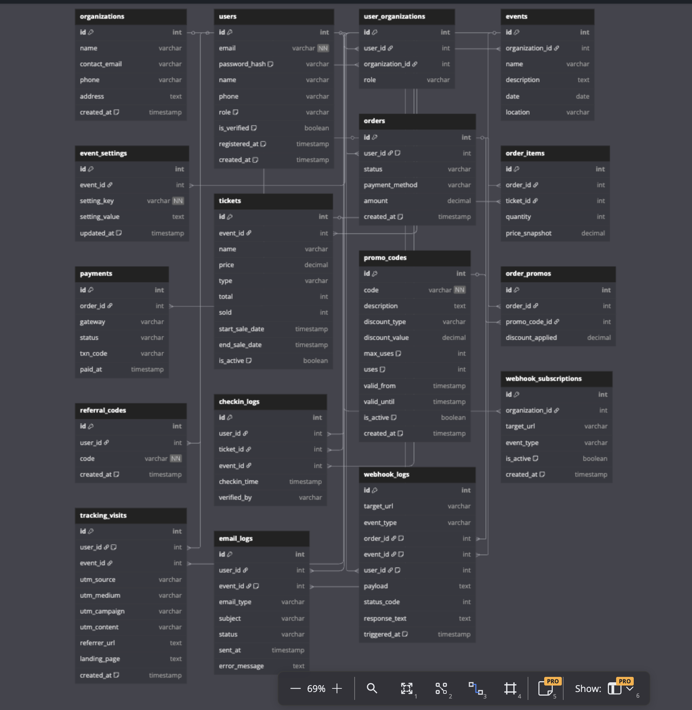

# ✨ OCX Online Ticketing Platform - Database Design README



## 📊 Design Purpose

This database is designed for an online event ticketing system (SaaS model), supporting:

* Multi-tenant (multiple organizers)
* Multiple user roles
* Guest checkout (no login required)
* Tracking traffic from Facebook, Google, Email, etc.
* Automation: email, webhook, promo codes, referral partners

---

## 👥 1. USERS & ORGANIZATIONS

### `organizations`

```sql
Table organizations {
  id int [pk, increment]
  name varchar
  contact_email varchar
  phone varchar
  address text
  created_at timestamp [default: `now()`]
}
```

* Stores event organizer information

### `users`

```sql
Table users {
  id int [pk, increment]
  email varchar [not null, unique]
  password_hash varchar [note: 'Nullable if guest']
  name varchar
  phone varchar
  role varchar [default: 'guest'] // guest, user, org_admin, super_admin
  is_verified boolean [default: false]
  registered_at timestamp [note: 'Nullable, only when password is set']
  created_at timestamp [default: `now()`]
}
```

* Combines user and customer
* Roles: `guest`, `user`, `org_admin`, `super_admin`
* Allows guest ticket purchase, then register account to manage

### `user_organizations`

```sql
Table user_organizations {
  id int [pk, increment]
  user_id int [ref: > users.id]
  organization_id int [ref: > organizations.id]
  role varchar // org_admin, editor, viewer
}
```

* Many-to-many: each user can belong to many orgs, each org can have many users

---

## 🎟️ 2. EVENTS & TICKETS

### `events`

```sql
Table events {
  id int [pk, increment]
  organization_id int [ref: > organizations.id]
  name varchar
  description text
  date date
  location varchar
}
```

* Organizer's event

### `event_settings`

```sql
Table event_settings {
  id int [pk, increment]
  event_id int [ref: > events.id]
  setting_key varchar [not null]
  setting_value text
  updated_at timestamp [default: `now()`]
}
```

* Stores event UI/settings customization

### `tickets`

```sql
Table tickets {
  id int [pk, increment]
  event_id int [ref: > events.id]
  name varchar
  price decimal
  type varchar // VIP, Regular, Early Bird
  total int
  sold int
  start_sale_date timestamp
  end_sale_date timestamp
  is_active boolean [default: true]
}
```

* Ticket types: VIP, Regular, Early Bird

---

## 💳 3. ORDERS & PAYMENTS

### `orders`

```sql
Table orders {
  id int [pk, increment]
  user_id int [ref: > users.id, note: 'Nullable if guest']
  status varchar // pending, paid, failed
  payment_method varchar // momo, sepapy, vnpay
  amount decimal
  created_at timestamp [default: `now()`]
}
```

* Ticket order: whether user is guest or registered

### `order_items`

```sql
Table order_items {
  id int [pk, increment]
  order_id int [ref: > orders.id]
  ticket_id int [ref: > tickets.id]
  quantity int
  price_snapshot decimal
}
```

* Details of each ticket type in the order

### `payments`

```sql
Table payments {
  id int [pk, increment]
  order_id int [ref: > orders.id]
  gateway varchar
  status varchar // success, failed
  txn_code varchar
  paid_at timestamp
}
```

* Records transaction status: MoMo, VNPAY, etc.

---

## ✉️ 4. EMAIL & WEBHOOK

### `email_logs`

```sql
Table email_logs {
  id int [pk, increment]
  user_id int [ref: > users.id]
  event_id int [ref: > events.id, note: 'Nullable if system email']
  email_type varchar // confirmation, reminder, promo, refund_notice
  subject varchar
  status varchar // sent, failed, queued
  sent_at timestamp
  error_message text
}
```

* Track email sending: order confirmation, show reminder, promotion...

### `webhook_logs`

```sql
Table webhook_logs {
  id int [pk, increment]
  target_url varchar
  event_type varchar // payment_success, order_created, ticket_checked_in, etc.
  order_id int [ref: > orders.id, note: 'Nullable']
  event_id int [ref: > events.id, note: 'Nullable']
  user_id int [ref: > users.id, note: 'Nullable']
  payload text
  status_code int
  response_text text
  triggered_at timestamp [default: `now()`]
}
```

* Linked to event/order/user

### `webhook_subscriptions`

```sql
Table webhook_subscriptions {
  id int [pk, increment]
  organization_id int [ref: > organizations.id]
  target_url varchar
  event_type varchar // event type to listen
  is_active boolean [default: true]
  created_at timestamp [default: `now()`]
}
```

* Set webhook for each org (Zapier, CRM, etc.)

---

## 📣 5. PROMOTIONS & REFERRALS

### `promo_codes`

```sql
Table promo_codes {
  id int [pk, increment]
  code varchar [not null, unique]
  description text
  discount_type varchar // percent, fixed
  discount_value decimal
  max_uses int [default: 1]
  uses int [default: 0]
  valid_from timestamp
  valid_until timestamp
  is_active boolean [default: true]
  created_at timestamp [default: `now()`]
}
```

* Promo codes: fixed/percent, usage limit, date limit

### `order_promos`

```sql
Table order_promos {
  id int [pk, increment]
  order_id int [ref: > orders.id]
  promo_code_id int [ref: > promo_codes.id]
  discount_applied decimal
}
```

* Link promo code to order

### `referral_codes`

```sql
Table referral_codes {
  id int [pk, increment]
  user_id int [ref: > users.id]
  code varchar [not null, unique]
  created_at timestamp [default: `now()`]
}
```

* Referral code created by user

---

## 🔹 6. TRACKING TRAFFIC

### `tracking_visits`

```sql
Table tracking_visits {
  id int [pk, increment]
  user_id int [ref: > users.id, note: 'Nullable, if user logged in or bought ticket']
  event_id int [ref: > events.id]
  utm_source varchar
  utm_medium varchar
  utm_campaign varchar
  utm_content varchar
  referrer_url text
  landing_page text
  created_at timestamp [default: `now()`]
}
```

* Supports Facebook Pixel, Google Ads, Email campaign...

---

## 🌐 7. CHECK-IN SYSTEM

### `checkin_logs`

```sql
Table checkin_logs {
  id int [pk, increment]
  user_id int [ref: > users.id]
  ticket_id int [ref: > tickets.id]
  event_id int [ref: > events.id]
  checkin_time timestamp
  verified_by varchar
}
```

* Record QR scan history at entrance

---

## 📊 Scale & Vision

### ✅ Can be extended with:

* Loyalty & point system
* Ticket resale / transfer
* Post-event feedback
* CMS for landing page

### 🚀 Scalability:

* Query optimization
* Suitable for sharding by organization_id
* Modular enough for future microservices

---

## 🌐 Real Use Case

**Scenario:** Organization X hosts Indie Show

* Create event A on the platform
* Upload banner, set theme via `event_settings`
* Run Facebook ads: track via `tracking_visits`
* Sell tickets: Early Bird + VIP
* Code WELCOME10: 10% off first purchase
* Auto-send email + webhook to CRM on payment
* At venue: QR check-in

All these flows are fully supported in the current DB.
