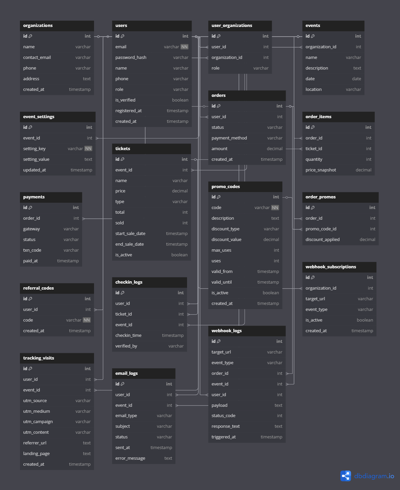

# ✨ OCX Online Ticketing Platform - Database Design README



## 📊 Mục Đích Thiết Kế

Database này được thiết kế cho một hệ thống bán vé sự kiện trực tuyến theo mô hình SaaS, hỗ trợ:

* Nhiều nhà tổ chức (multi-tenant)
* Nhiều vai trò người dùng
* Guest checkout (không cần đăng nhập)
* Theo dõi traffic từ Facebook, Google, Email, v.v.
* Automation: email, webhook, mã giảm giá, đối tác referral

---

## 👥 1. USERS & ORGANIZATIONS

### `organizations`

```sql
Table organizations {
  id int [pk, increment]
  name varchar
  contact_email varchar
  phone varchar
  address text
  created_at timestamp [default: `now()`]
}
```

* Lưu thông tin nhà tổ chức sự kiện

### `users`

```sql
Table users {
  id int [pk, increment]
  email varchar [not null, unique]
  password_hash varchar [note: 'Nullable nếu là guest']
  name varchar
  phone varchar
  role varchar [default: 'guest'] // guest, user, org_admin, super_admin
  is_verified boolean [default: false]
  registered_at timestamp [note: 'Nullable, chỉ có khi tạo mật khẩu']
  created_at timestamp [default: `now()`]
}
```

* Gộp chung user và customer
* Vai trò: `guest`, `user`, `org_admin`, `super_admin`
* Cho phép mua vé vào vai guest, sau đó đăng ký tài khoản để quản lý

### `user_organizations`

```sql
Table user_organizations {
  id int [pk, increment]
  user_id int [ref: > users.id]
  organization_id int [ref: > organizations.id]
  role varchar // org_admin, editor, viewer
}
```

* Quan hệ n-n: mỗi user có thể thuộc nhiều orga, mỗi orga có nhiều user

---

## 🎟️ 2. EVENTS & TICKETS

### `events`

```sql
Table events {
  id int [pk, increment]
  organization_id int [ref: > organizations.id]
  name varchar
  description text
  date date
  location varchar
}
```

* Sự kiện của nhà tổ chức

### `event_settings`

```sql
Table event_settings {
  id int [pk, increment]
  event_id int [ref: > events.id]
  setting_key varchar [not null]
  setting_value text
  updated_at timestamp [default: `now()`]
}
```

* Lưu các tuỳ chỉnh giao diện / cài đặt của event

### `tickets`

```sql
Table tickets {
  id int [pk, increment]
  event_id int [ref: > events.id]
  name varchar
  price decimal
  type varchar // VIP, Regular, Early Bird
  total int
  sold int
  start_sale_date timestamp
  end_sale_date timestamp
  is_active boolean [default: true]
}
```

* Các loại vé: VIP, Regular, Early Bird

---

## 💳 3. ORDERS & PAYMENTS

### `orders`

```sql
Table orders {
  id int [pk, increment]
  user_id int [ref: > users.id, note: 'Nullable nếu là khách vãng lai']
  status varchar // pending, paid, failed
  payment_method varchar // momo, sepapy, vnpay
  amount decimal
  created_at timestamp [default: `now()`]
}
```

* Đơn hàng bán vé: dù user là guest hay đã đăng nhập

### `order_items`

```sql
Table order_items {
  id int [pk, increment]
  order_id int [ref: > orders.id]
  ticket_id int [ref: > tickets.id]
  quantity int
  price_snapshot decimal
}
```

* Chi tiết số lượng từng loại vé trong đơn hàng

### `payments`

```sql
Table payments {
  id int [pk, increment]
  order_id int [ref: > orders.id]
  gateway varchar
  status varchar // success, failed
  txn_code varchar
  paid_at timestamp
}
```

* Ghi nhận trạng thái giao dịch: thanh toán MoMo, VNPAY, v.v.

---

## ✉️ 4. EMAIL & WEBHOOK

### `email_logs`

```sql
Table email_logs {
  id int [pk, increment]
  user_id int [ref: > users.id]
  event_id int [ref: > events.id, note: 'Nullable nếu là email hệ thống']
  email_type varchar // confirmation, reminder, promo, refund_notice
  subject varchar
  status varchar // sent, failed, queued
  sent_at timestamp
  error_message text
}
```

* Theo dõi việc gửi mail: xác nhận đơn, nhắc show, khuyến mãi...

### `webhook_logs`

```sql
Table webhook_logs {
  id int [pk, increment]
  target_url varchar
  event_type varchar // payment_success, order_created, ticket_checked_in, etc.
  order_id int [ref: > orders.id, note: 'Nullable']
  event_id int [ref: > events.id, note: 'Nullable']
  user_id int [ref: > users.id, note: 'Nullable']
  payload text
  status_code int
  response_text text
  triggered_at timestamp [default: `now()`]
}
```

* Gắn với event/order/user

### `webhook_subscriptions`

```sql
Table webhook_subscriptions {
  id int [pk, increment]
  organization_id int [ref: > organizations.id]
  target_url varchar
  event_type varchar // loại sự kiện muốn nghe
  is_active boolean [default: true]
  created_at timestamp [default: `now()`]
}
```

* Cài webhook cho từng orga (Zapier, CRM, v.v.)

---

## 📣 5. PROMOTIONS & REFERRALS

### `promo_codes`

```sql
Table promo_codes {
  id int [pk, increment]
  code varchar [not null, unique]
  description text
  discount_type varchar // percent, fixed
  discount_value decimal
  max_uses int [default: 1]
  uses int [default: 0]
  valid_from timestamp
  valid_until timestamp
  is_active boolean [default: true]
  created_at timestamp [default: `now()`]
}
```

* Mã giảm giá: fixed/percent, hạn dùng, hạn ngày

### `order_promos`

```sql
Table order_promos {
  id int [pk, increment]
  order_id int [ref: > orders.id]
  promo_code_id int [ref: > promo_codes.id]
  discount_applied decimal
}
```

* Liên kết promo code với đơn hàng

### `referral_codes`

```sql
Table referral_codes {
  id int [pk, increment]
  user_id int [ref: > users.id]
  code varchar [not null, unique]
  created_at timestamp [default: `now()`]
}
```

* Mã giới thiệu do user tạo

---

## 🔹 6. TRACKING TRAFFIC

### `tracking_visits`

```sql
Table tracking_visits {
  id int [pk, increment]
  user_id int [ref: > users.id, note: 'Nullable, có nếu user đăng nhập hoặc mua vé']
  event_id int [ref: > events.id]
  utm_source varchar
  utm_medium varchar
  utm_campaign varchar
  utm_content varchar
  referrer_url text
  landing_page text
  created_at timestamp [default: `now()`]
}
```

* Hỗ trợ Facebook Pixel, Google Ads, Email campaign...

---

## 🌐 7. CHECK-IN SYSTEM

### `checkin_logs`

```sql
Table checkin_logs {
  id int [pk, increment]
  user_id int [ref: > users.id]
  ticket_id int [ref: > tickets.id]
  event_id int [ref: > events.id]
  checkin_time timestamp
  verified_by varchar
}
```

* Ghi nhận lịch sử quét QR tại cửa vào

---

## 📊 Scale & Vision

### ✅ Có thể mở rộng với:

* Loyalty & point system
* Ticket resale / transfer
* Feedback sau event
* CMS cho landing page

### 🚀 Khả năng scale:

* Tối ưu truy vấn
* Thích hợp sharding theo organization\_id
* Đủ modular để chia microservice sau này

---

## 🌐 Use Case Thực Tế

**Tình huống:** Đơn vị X tổ chức Show Indie

* Tạo event A trên platform
* Up banner, cài theme qua `event_settings`
* Chạy ads Facebook: tracking qua `tracking_visits`
* Bán vé: Early Bird + VIP
* Mã WELCOME10: 10% off lần đầu
* Tự động gửi mail + webhook bên CRM khi thanh toán
* Tại sân: check-in QR

Tất cả flow này được support toàn diện trong DB hiện tại.

👉 Gợi ý: có thể nhúng sơ đồ ERD từ [dbdiagram.io](https://dbdiagram.io/) để minh hoạ tổng thể.
